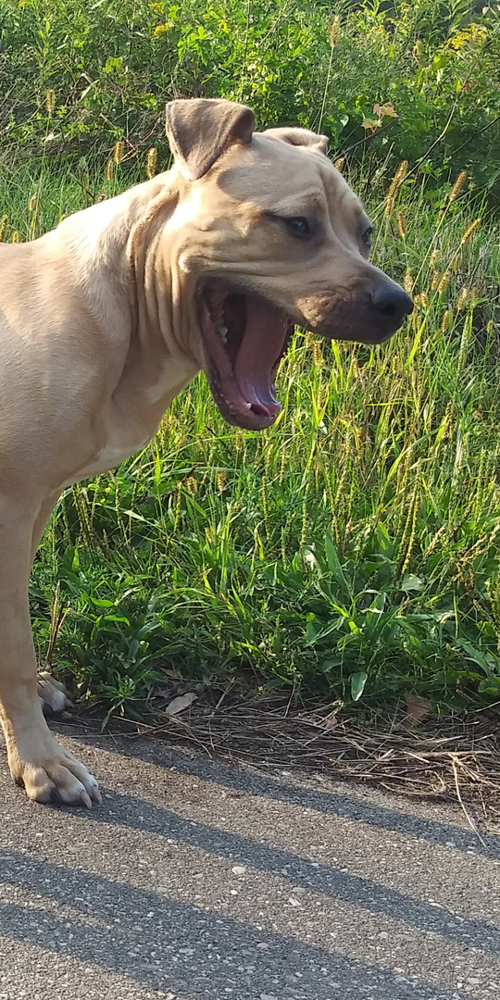
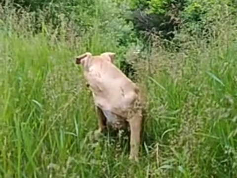
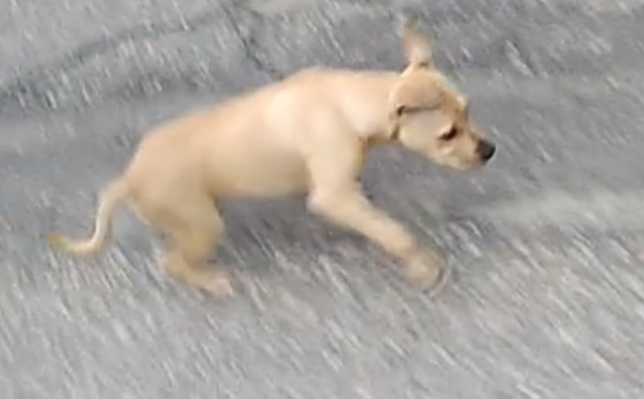

# [gait](https://github.com/serviceanimals/gait)

<!-- 
-->
What is your [service animal's](https://www.duckduckgo.com/?q=service+animal+faq+site%3Aada.gov) gait?  This service puppy who is trying to grow up to be a service dog has difficulty walking and running;  Tap an image to download a video depicting her gait.  Can you help?  If you can help, please contributed.

<!-- [Issues at this repository](https://github.com/serviceanimals/gait/issues)

[Pulls at this repository](https://github.com/serviceanimals/gait/pulls)

#EOF -->
